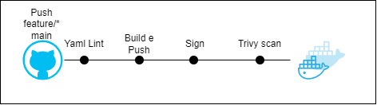

# LinuxTIPS- Giropops Senhas

### Descrição
Esse repositório agrupa os arquivos de deploy da aplicação Giropops Senhas num cluter Kubernetes como parte da avaliação do Programa Intensivo de Containers e Kubernetes da @LinuxTips.

### A Aplicação

A aplicação Giropops Senhas é uma API escrita em Flask que, conectada a um Redis, gera e armazena strings aleatórias de acordo com as especificações de número de caracteres, caracteres especiais e números passadas pelo usuário.

## Configuração
### Construção da Imagem Giropops-Senhas e pipeline

A imagem da aplicação foi construída pensando nas melhores práticas em containers. 

A primeira coisa é que a imagem é _distroless_. Isso significa que a imagem contém unicamente os componentes necessários para sua execução, o que não apenas reduz o tamanho da imagem (diminuindo custos), mas também aumenta a segurança (pela diminuição das opções de ataque). No caso deste projeto a imagem base é da [Chainguard](https://edu.chainguard.dev/chainguard/chainguard-images/reference/python/). 

A segunda prática utilizada foi a utilização de _multi-stage build_. Essa prática permite que a imagem final seja mais limpa e segura também. Nesse projeto, toda a instalação de dependências da imagem é feita usando como base a imagem `cgr.dev/chainguard/python:latest-dev` que permite mais flexibilidade no download e instalação. Após todos os requisitos instalados, a única pasta necessária é `/home/nonroot/.local/lib/python3.12/site-packages`, que é copiada para a imagem final, onde a aplicação será montada para ser executada.

Além dessas práticas, a imagem foi assinada e passou por verificação de vulnerabilidades do Trivy e do docker scout. Os resultados de cada uma dessas etapas pode ser verificado na seção de resultados deste documento. Essas etapas também foram automatizadas, e o pipeline de build da imagem pode ser verificado abaixo:



A cada push para branches com prefixo 'feature/' ou para a branch main, esse pipeline executará:

1. O lint para todos os arquivos yaml/yml no repositório;
2. O build da imagem baseado no Dockerfile e a publicação no docker hub (é importante notar que algumas configuraçãos de segredos no repositório são necessárias);
3. A assinatura, usando cosign, da imagem publicada;
4. O scan de vulnerabilidades utilizando o trivy, da aqua security.

[!WARNING]  
Note que neste estágio (v1.0.0), a imagem não é automaticamente deployada no cluster kubernetes. Seu deploy depende da atualização manual dos arquivos de configuração que serão discutidos abaixo.

### Configuração do Cluster Kubernetes

### Especificações

Esse projeto foi executado e validado usando o serviço EKS da AWS. Validações em cluster do tipo Kind ou bare metal serão realizadas.

Atualmente a especificação é:

Para o cluster:

- 2 Workers t3.medium
- 1 Control Plane gerenciado pela AWS

Para build automatizado da aplicação:

- Conta no dockerhub
- Repositório no github com acesso ao GitHub Actions


Para builds locais:

- Docker CLI


## Resultados


## Resultados do Scan do trivy contra a versão 2.0
```
➜  app git:(feature/dockerfile) ✗ sudo trivy image isadora/linuxtips-giropops-senhas:2.0
2023-11-26T10:30:50.893Z        INFO    Vulnerability scanning is enabled
2023-11-26T10:30:50.893Z        INFO    Secret scanning is enabled
2023-11-26T10:30:50.893Z        INFO    If your scanning is slow, please try '--scanners vuln' to disable secret scanning
2023-11-26T10:30:50.893Z        INFO    Please see also https://aquasecurity.github.io/trivy/v0.47/docs/scanner/secret/#recommendation for faster secret detection
2023-11-26T10:30:51.039Z        INFO    Detected OS: wolfi
2023-11-26T10:30:51.039Z        INFO    Detecting Wolfi vulnerabilities...
2023-11-26T10:30:51.043Z        INFO    Number of language-specific files: 1
2023-11-26T10:30:51.048Z        INFO    Detecting python-pkg vulnerabilities...

isadora/linuxtips-giropops-senhas:2.0 (wolfi 20230201)

Total: 0 (UNKNOWN: 0, LOW: 0, MEDIUM: 0, HIGH: 0, CRITICAL: 0)

2023-11-26T10:30:51.049Z        INFO    Table result includes only package filenames. Use '--format json' option to get the full path to the package file.

Python (python-pkg)

Total: 3 (UNKNOWN: 0, LOW: 1, MEDIUM: 1, HIGH: 1, CRITICAL: 0)

┌──────────────────┬────────────────┬──────────┬────────┬───────────────────┬─────────────────────┬────────────────────────────────────────────────────────────┐
│     Library      │ Vulnerability  │ Severity │ Status │ Installed Version │    Fixed Version    │                           Title                            │
├──────────────────┼────────────────┼──────────┼────────┼───────────────────┼─────────────────────┼────────────────────────────────────────────────────────────┤
│ Flask (METADATA) │ CVE-2023-30861 │ HIGH     │ fixed  │ 2.1.1             │ 2.3.2, 2.2.5        │ flask: Possible disclosure of permanent session cookie due │
│                  │                │          │        │                   │                     │ to missing Vary: Cookie...                                 │
│                  │                │          │        │                   │                     │ https://avd.aquasec.com/nvd/cve-2023-30861                 │
├──────────────────┼────────────────┼──────────┤        ├───────────────────┼─────────────────────┼────────────────────────────────────────────────────────────┤
│ redis (METADATA) │ CVE-2023-28859 │ MEDIUM   │        │ 4.5.2             │ 4.5.4, 4.4.4        │ Async command information disclosure                       │
│                  │                │          │        │                   │                     │ https://avd.aquasec.com/nvd/cve-2023-28859                 │
│                  ├────────────────┼──────────┤        │                   ├─────────────────────┼────────────────────────────────────────────────────────────┤
│                  │ CVE-2023-28858 │ LOW      │        │                   │ 4.4.3, 4.5.3, 4.3.6 │ Async command information disclosure                       │
│                  │                │          │        │                   │                     │ https://avd.aquasec.com/nvd/cve-2023-28858                 │
└──────────────────┴────────────────┴──────────┴────────┴───────────────────┴─────────────────────┴────────────────────────────────────────────────────────────┘
```

## Resultados do Scan do trivy contra a versão 3.0
```
➜  app git:(feature/dockerfile) ✗ sudo trivy image isadora/linuxtips-giropops-senhas:3.0
2023-11-26T10:33:48.789Z        INFO    Vulnerability scanning is enabled
2023-11-26T10:33:48.789Z        INFO    Secret scanning is enabled
2023-11-26T10:33:48.789Z        INFO    If your scanning is slow, please try '--scanners vuln' to disable secret scanning
2023-11-26T10:33:48.789Z        INFO    Please see also https://aquasecurity.github.io/trivy/v0.47/docs/scanner/secret/#recommendation for faster secret detection
2023-11-26T10:33:50.255Z        INFO    Detected OS: wolfi
2023-11-26T10:33:50.255Z        INFO    Detecting Wolfi vulnerabilities...
2023-11-26T10:33:50.256Z        INFO    Number of language-specific files: 1
2023-11-26T10:33:50.256Z        INFO    Detecting python-pkg vulnerabilities...

isadora/linuxtips-giropops-senhas:3.0 (wolfi 20230201)

Total: 0 (UNKNOWN: 0, LOW: 0, MEDIUM: 0, HIGH: 0, CRITICAL: 0)
```


## Como instalar o docker scout CLI
<details>
<summary>Resultados do docker scout contra a versão 3.0</summary>
<br>

```
➜  LINUXtips-giropops-senhas git:(feature/dockerfile) docker scout cves isadora/linuxtips-giropops-senhas:3.0
    ...Storing image for indexing
    ✓ Image stored for indexing
    ...Indexing
    ✓ Indexed 39 packages
    ✓ No vulnerable package detected
```

```
                    │             Analyzed Image
────────────────────┼──────────────────────────────────────────
  Target            │  isadora/linuxtips-giropops-senhas:3.0
    digest          │  67d8a6f7edab
    platform        │ linux/amd64
    vulnerabilities │    0C     0H     0M     0L
    size            │ 25 MB
    packages        │ 39
```
</details>

## Primeiro teste de performance

```
     ✗ response code was 200
      ↳  99% — ✓ 149581 / ✗ 498

     checks.........................: 99.66% ✓ 149581    ✗ 498
     data_received..................: 2.2 GB 10 MB/s
     data_sent......................: 20 MB  92 kB/s
     http_req_blocked...............: avg=139.49µs min=0s      med=2.28µs   max=157.47ms p(90)=2.5µs   p(95)=3.35µs
     http_req_connecting............: avg=18.7µs   min=0s      med=0s       max=27.67ms  p(90)=0s      p(95)=0s
   ✗ http_req_duration..............: avg=701.81ms min=1.92ms  med=35.5ms   max=1m0s     p(90)=1.49s   p(95)=3.89s
       { expected_response:true }...: avg=573.12ms min=3.45ms  med=35.29ms  max=59.74s   p(90)=1.45s   p(95)=3.76s
   ✓ http_req_failed................: 0.33%  ✓ 498       ✗ 149581
     http_req_receiving.............: avg=909.33µs min=0s      med=468.87µs max=59.26ms  p(90)=1.5ms   p(95)=2.35ms
     http_req_sending...............: avg=42.89µs  min=13.93µs med=39.15µs  max=6.45ms   p(90)=61.96µs p(95)=74.93µs
     http_req_tls_handshaking.......: avg=116.67µs min=0s      med=0s       max=154.91ms p(90)=0s      p(95)=0s
     http_req_waiting...............: avg=700.86ms min=1.87ms  med=34.86ms  max=1m0s     p(90)=1.49s   p(95)=3.89s
     http_reqs......................: 150079 707.59271/s
     iteration_duration.............: avg=702.07ms min=2.35ms  med=35.86ms  max=1m0s     p(90)=1.49s   p(95)=3.89s
     iterations.....................: 150079 707.59271/s
     vus............................: 1      min=1       max=999
     vus_max........................: 1000   min=1000    max=1000


running (3m32.1s), 0000/1000 VUs, 150079 complete and 36 interrupted iterations
breaking ✓ [======================================] 0000/1000 VUs  3m10s
ERRO[0213] thresholds on metrics 'http_req_duration' have been crossed

```

## Resultado do segundo teste de performance apos configura;'ao do HPA:
```
     ✗ response code was 200
      ↳  99% — ✓ 158545 / ✗ 29

     checks.........................: 99.98% ✓ 158545     ✗ 29
     data_received..................: 2.3 GB 12 MB/s
     data_sent......................: 20 MB  106 kB/s
     http_req_blocked...............: avg=672.88µs min=0s       med=2.27µs   max=566.92ms p(90)=2.51µs  p(95)=3.45µs
     http_req_connecting............: avg=17.33µs  min=0s       med=0s       max=16.92ms  p(90)=0s      p(95)=0s
   ✗ http_req_duration..............: avg=649.8ms  min=3.6ms    med=316.7ms  max=58.98s   p(90)=1.71s   p(95)=2.15s
       { expected_response:true }...: avg=647.16ms min=3.6ms    med=316.68ms max=58.98s   p(90)=1.71s   p(95)=2.15s
   ✓ http_req_failed................: 0.01%  ✓ 29         ✗ 158545
     http_req_receiving.............: avg=1.65ms   min=0s       med=1.15ms   max=79.22ms  p(90)=3.42ms  p(95)=6.96ms
     http_req_sending...............: avg=42.66µs  min=14.49µs  med=36.8µs   max=8.14ms   p(90)=61.43µs p(95)=75.71µs
     http_req_tls_handshaking.......: avg=651.61µs min=0s       med=0s       max=564.3ms  p(90)=0s      p(95)=0s
     http_req_waiting...............: avg=648.11ms min=454.35µs med=314.32ms max=58.97s   p(90)=1.7s    p(95)=2.14s
     http_reqs......................: 158574 834.490291/s
     iteration_duration.............: avg=650.6ms  min=3.7ms    med=317.7ms  max=58.98s   p(90)=1.71s   p(95)=2.15s
     iterations.....................: 158574 834.490291/s
     vus............................: 25     min=2        max=999
     vus_max........................: 1000   min=1000     max=1000
```

## Resultado no terceiro teste, sem considerar latencia:
```

     checks.........................: 99.99% ✓ 160502     ✗ 15
     data_received..................: 2.3 GB 12 MB/s
     data_sent......................: 21 MB  107 kB/s
     http_req_blocked...............: avg=1.31ms   min=0s      med=2.27µs   max=1.85s    p(90)=2.52µs p(95)=3.52µs
     http_req_connecting............: avg=19.39µs  min=0s      med=0s       max=24.26ms  p(90)=0s     p(95)=0s
     http_req_duration..............: avg=639.9ms  min=3.91ms  med=446.62ms max=55.37s   p(90)=1.23s  p(95)=2.03s
       { expected_response:true }...: avg=637.11ms min=3.91ms  med=446.57ms max=55.37s   p(90)=1.23s  p(95)=2.03s
   ✓ http_req_failed................: 0.00%  ✓ 15         ✗ 160502
     http_req_receiving.............: avg=2.05ms   min=0s      med=1.24ms   max=130.07ms p(90)=5.71ms p(95)=8.23ms
     http_req_sending...............: avg=42.01µs  min=13.56µs med=35.7µs   max=9.01ms   p(90)=61.6µs p(95)=76.02µs
     http_req_tls_handshaking.......: avg=1.28ms   min=0s      med=0s       max=1.85s    p(90)=0s     p(95)=0s
     http_req_waiting...............: avg=637.8ms  min=3.47ms  med=444.08ms max=55.37s   p(90)=1.23s  p(95)=2.03s
     http_reqs......................: 160517 829.880724/s
     iteration_duration.............: avg=641.34ms min=4.02ms  med=447.87ms max=55.37s   p(90)=1.23s  p(95)=2.03s
     iterations.....................: 160517 829.880724/s
     vus............................: 2      min=2        max=999
     vus_max........................: 1000   min=1000     max=1000


running (3m13.4s), 0000/1000 VUs, 160517 complete and 3 interrupted iterations
breaking ✓ [======================================] 0000/1000 VUs  3m10s

```

### Evento de scale UP no HPA:
➜  manifestos git:(feature/performance-testes) ✗ k describe hpa giropops-senhas-deployment-hpa
Name:                                                     giropops-senhas-deployment-hpa
Namespace:                                                default
Labels:                                                   <none>
Annotations:                                              <none>
CreationTimestamp:                                        Sun, 03 Dec 2023 19:51:01 +0000
Reference:                                                Deployment/giropops-senhas
Metrics:                                                  ( current / target )
  resource memory on pods  (as a percentage of request):  59% (39926169600m) / 70%
  resource cpu on pods  (as a percentage of request):     0% (1m) / 50%
Min replicas:                                             3
Max replicas:                                             5
Deployment pods:                                          5 current / 5 desired
Conditions:
  Type            Status  Reason               Message
  ----            ------  ------               -------
  AbleToScale     True    ScaleDownStabilized  recent recommendations were higher than current one, applying the highest recent recommendation
  ScalingActive   True    ValidMetricFound     the HPA was able to successfully calculate a replica count from memory resource utilization (percentage of request)
  ScalingLimited  True    TooManyReplicas      the desired replica count is more than the maximum replica count
Events:
  Type    Reason             Age   From                       Message
  ----    ------             ----  ----                       -------
  Normal  SuccessfulRescale  15m   horizontal-pod-autoscaler  New size: 5; reason: cpu resource utilization (percentage of request) above target


1. Crie um cluster EKS
```bash 
eksctl create cluster --name=eks-cluster-pick --version=1.23 --region=us-east-1 --nodegroup-name=eks-cluster-pick-nodegroup --node-type=t3.medium --nodes=2 --nodes-min=1 --nodes-max=3 --managed
```

2. Crie os serviços e deploymentsÇ
```bash
➜  k apply -f app/giropops-senhas-deploy.yml
deployment.apps/giropops-senhas created
➜  k apply -f app/giropops-senhas-svc.yml
service/giropops-senhas created
➜  k apply -f app/redis-deploy.yml
deployment.apps/redis-deployment created
➜  k apply -f app/redis-svc.yml
```

3. Instale o Nginx-Ingress
```bash
➜  kubectl apply -f https://raw.githubusercontent.com/kubernetes/ingress-nginx/controller-v1.8.2/deploy/static/provider/aws/deploy.yaml

➜  k get all -n ingress-nginx
NAME                                            READY   STATUS      RESTARTS   AGE
pod/ingress-nginx-admission-create-4kk2c        0/1     Completed   0          25s
pod/ingress-nginx-admission-patch-9p9v6         0/1     Completed   1          25s
pod/ingress-nginx-controller-76df4778bf-xjx6p   1/1     Running     0          25s

```

4. Instale o Cert-Manager
```bash
➜  kubectl apply -f https://github.com/cert-manager/cert-manager/releases/download/v1.13.2/cert-manager.yaml

```

5. Crie um produtction issuer
```bash
k apply -f letsencrypt/production-issuer.yml
```

6. Crie certificado para a aplicação
```bash
openssl req -x509 -nodes -days 365 -newkey rsa:2048 -keyout projeto-pick.key -out projeto-pick.crt
```

7. Crie um secret com o certificado 
```bash
k create secret tls projeto-pick-tls --cert=projeto-pick.crt --key=projeto-pick.key
```

8. Crie o Ingress e aguarde até o que o endereço do LoadBalancer seja atribuido
Aqui é importante lembrar que para o certificado ser validado pelo let's encrypt é importante que o DNS senha resolvível de dentro do cluster, e que o serviço esteja escutando na porta 443.
```bash
k apply -f manifestos/ingress/projeto-pick-ingress-prod.ym
➜ k get ingress -A -w
NAMESPACE   NAME                        CLASS   HOSTS                        ADDRESS   PORTS     AGE
default     cm-acme-http-solver-mbp5n   nginx   projeto-pick.ibmenezes.com             80        15s
default     giropops-senhas             nginx   projeto-pick.ibmenezes.com             80, 443   17s
default     cm-acme-http-solver-mbp5n   nginx   projeto-pick.ibmenezes.com   afa24b32d08e042839e13b2c51ddc66e-806f16f55c9c9c6d.elb.us-east-1.amazonaws.com   80        33s
default     giropops-senhas             nginx   projeto-pick.ibmenezes.com   afa24b32d08e042839e13b2c51ddc66e-806f16f55c9c9c6d.elb.us-east-1.amazonaws.com   80, 443   35s
```

9. Instale o Prometheus Operator

```bash
➜  git clone https://github.com/prometheus-operator/kube-prometheus
➜  cd kube-prometheus
➜  kubectl create -f manifests/setup
➜  k apply -f manifests
```

Para acessar os serviços, edite cada um deles para que tenham uma NodePort.
Atenção: Essa não é a prática recomendada, o Prometheus e o Alert manager não tem autenticação por padrão e essa configuração não deve ser feita em ambientes produtivos.


```
k edit svc -n monitoring prometheus-k8s
k edit svc -n monitoring alertmanager-main
k edit svc grafana -n monitoring
```
